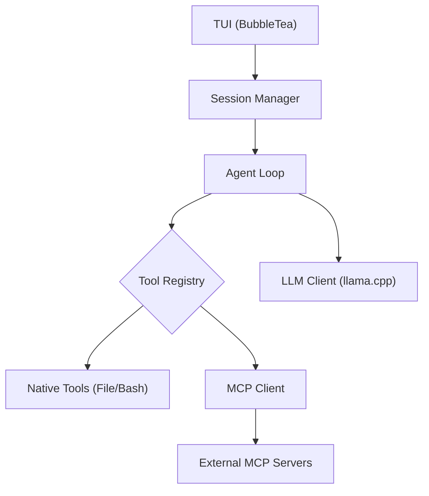

# Late

**Late** (Lightweight AI Terminal Environment) is a local-first coding agent that runs on consumer hardware without the 10k token bloat.

> **Philosophy**: "Logic belongs in the Code, not in the Context Window."


## Why Late?

Most AI coding agents rely on "Context Stuffing"—throwing 10k+ tokens of instructions at a frontier model (Claude/GPT-5) and hoping it mimics a developer.

**Late takes a Systems Engineering approach.**
Instead of asking the LLM to *be* a coder, Late uses the LLM strictly for **token generation** within a deterministic state machine written in Go.

- **Efficiency**: The Core System Prompt is **<80 lines**.
- **Deterministic Block-Matching:** Uses strict <<<< / ==== / >>>> diff syntax instead of relying on the LLM to hallucinate line numbers
- **Native MCP**: Implements the [Model Context Protocol](https://github.com/modelcontextprotocol) directly, allowing it to use any standard MCP server.
- **Subagent Loops**: Spawns isolated, task-specific subagents (Researcher/Coder) that run in their own ephemeral context loops.

## How It Works

Late gets the most out of local models (like Qwen3-Coder-Next) by keeping things simple:
1. **Tiny Prompts**: The core instructions are short and focused.
2. **Strict Parsing**: It relies on a simple `<<<</====/>>>>` diff format that models can easily output.
3. **Subagent Delegation**: Instead of filling up one massive context window, complex tasks are handed off to subagents with fresh, empty contexts.

> *Note: The prompt architecture is heavily inspired by the work of [Bijan Bowen](https://www.youtube.com/@Bijanbowen).*

## Features

- **100% Local**: No API keys. No cloud. No telemetry.
- **TUI**: Fast Bubble Tea interface with "Thinking" visualization.
- **Self-Healing**: Supervisors detect subagent failures and re-attempts with corrected context.
- **Stateful**: Maintains session history on disk (`~/.local/share/Late`).

## Requirements

Late requires an OpenAI compatible instance. Set the `OPENAI_BASE_URL` environment variable to the base URL of your OpenAI compatible instance. For example:

```bash
export OPENAI_BASE_URL="http://localhost:8080"
```

> ⚠️ **Critical Requirement**: Upstream `llama.cpp` currently has an issue that causes crashes during context shifts with subagents (slots).
>
> If you use llama.cpp you **MUST** use this version for stability:
> 
> [[Autoparser - complete refactoring of parser architecture#18675
](https://github.com/ggml-org/llama.cpp/pull/18675)]

## Installation

```bash
# Clone and Build
git clone https://github.com/mlhher/late
cd late
make build

# Install
make install
```

## Usage

Start the TUI:
```bash
late
```


## Architecture



## Known Issues
**Late** is a raw tool that does not hold your hand. Expect the following behaviors from local LLMs:

- **LLM Halting**: Local models sometimes drop the stop token or halt generation mid-stream. If the agent stalls, simply type continue to nudge it.

- **Subagent Deadlocks**: Local models can occasionally get stubborn and argue with the supervisor agent. If a subagent loops infinitely, hit Ctrl-C. Your main session state is saved to disk, but the looping subagent is destroyed. Restarting clears the deadlock instantly. Simply tell the agent what happened ("the subagent disagreed with your evaluation please re-evaluate.")

- **TUI Lag on Massive Chats**: If your chat history becomes so massive that the Bubble Tea UI begins to slow down, your context window is too polluted anyway. Late is designed for focused, single-task sessions. If it lags, it's time to start a new session.

## Acknowledgements

- **[llama.cpp](https://github.com/ggerganov/llama.cpp)**: For making local AI possible.

- **[Piotr Wilkin](https://github.com/pwilkin)**: For the parser fix.

- **[Bijan Bowen](https://www.youtube.com/@Bijanbowen)**: For prompt engineering and testing research.

- **[Charm](https://github.com/charmbracelet)**: For the Bubble Tea framework.

## License

**Business Source License (BSL) 1.1**

We built this for engineers, not SaaS wrappers. 

- **Free for builders:** Use it for personal projects, internal development, and research.
- **Commercial Restrictions:** You may **not** wrap Late into a paid commercial service or SaaS product. 

*Late safely converts to an open-source GPLv2 license on February 21, 2030. Read the full [LICENSE](LICENSE).*