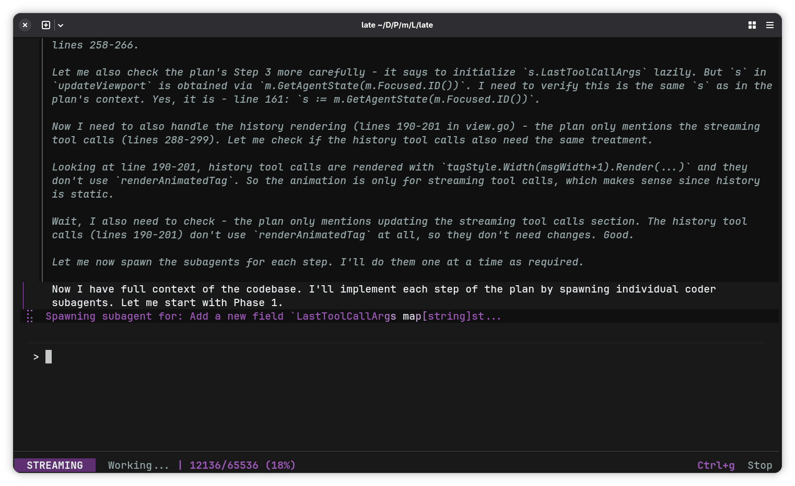

# Late: High-Leverage AI Agent Orchestration

[English](README.md) | [简体中文](README.zh-CN.md)

> Every other coding agent floods its own context with edits, retries and implementation details until the model loses the thread. Late delegates all of that to ephemeral subagents — isolated contexts that execute one task and are destroyed. The orchestrator sees only plans and outcomes, never the mess. Single static binary, zero dependencies, any model.

[](https://github.com/mlhher/late-cli/releases) [](https://github.com/mlhher/homebrew-late) [](https://goreportcard.com/report/github.com/mlhher/late) [](https://deepwiki.com/mlhher/late-cli)

**Drop into any project and start building.** Get to your first prompt in less than 10 seconds.

```bash
brew tap mlhher/late && brew install late
cd your-project
late
```

> **Not using Homebrew?**
> - **Arch Linux:** `yay -S late-cli-bin`
> - **Linux / macOS / Windows:** Download the [latest binary](https://github.com/mlhher/late-cli/releases) and drop it in your PATH. *(macOS manual download: if blocked, run `xattr -d com.apple.quarantine /path/to/late`)*
> 
> **Connecting to Cloud Models?**
> Local models (llama.cpp on `:8080`, the default for llama-server) work out-of-the-box. No configuration required. For cloud providers (DeepSeek, Claude, Gemini, OpenRouter), set your `OPENAI_BASE_URL`, `OPENAI_API_KEY`, and `OPENAI_MODEL` environment variables.


*Lead Architect forming a plan and spawning an atomic subagent for a surgical edit.*

|  | Late | Claude Code | OpenCode |
|---|---|---|---|
| Architecture | **Orchestrator + ephemeral subagents** | Single context window | Single context window |
| Implementations | **Isolated in subagents, destroyed after** | Flood main context | Flood main context |
| System prompt | **~1,000 tokens** | 10,000+ | 10,000+ (per default behavior) |
| Native tools | **5 (different per agent)** | 15+ | 15+ |
| Dependencies | **Zero — single binary** | Node.js | Node.js |
| Model support | **Any OpenAI-compatible** | Claude API | Multiple |

> *"The same model feels smarter with Late."* — Reddit

> *"Late-CLI is mindblowing... I'm shocked that the token usage is so minimal, I keep expecting a big bill from DeepSeek's API."* — GitHub Discussions

> [Outperforming Claude Code and Codex for Local LLM Workflows](https://agentnativedev.medium.com/outperforming-claude-code-and-codex-for-local-llm-workflows-5de0e2b1add5) — Agent Native

> **Built with Late:** Late is primarily developed inside Late itself.

Works with **Claude, DeepSeek, Qwen, Gemma (including thinking support for Gemma)**, and any OpenAI-compatible API. See the [Quickstart Guide](docs/quickstart.md) for hybrid model routing, keybindings, MCP setup, Skills and more.

---

## How It Works

Standard coding agents do all their work, whether it's planning, implementing, retrying failed edits, or self-healing, in one shared context window. Every retry, every failed implementation, every repair loop pollutes the context the model reasons from. It degrades. You blame the model. The model is fine.

Late separates concerns. A lean orchestrator (~1,000 token system prompt) reads your codebase, forms a plan, and delegates individual implementation tasks to ephemeral subagents. Each subagent gets a fresh isolated context containing only its one task and nothing else. When it completes, that context is destroyed. The orchestrator only ever sees outcomes.

Late manages the KV cache and context window carefully, leaving more room for reasoning. The orchestrator's context grows only from what matters: your instructions and the agent's decisions. Everything the subagent did to get there is gone with it. This is why the same model feels sharper in Late. It reasons from signal, not noise.

---

## Features

- **Hybrid model routing** — separate models for orchestrator and subagents. Plan with a large model, execute with a fast cheap one.
- **Exact-match diffs** — strict `search`/`replace` blocks with autonomous self-healing on mismatch. Edits fail loud, never silently corrupt files.
- **Human-in-the-loop** — reads auto-approved, mutations hard-stop for `[y/N]`. Session, project, and global trust scopes with TTL decay.
- **Session save/resume** — checkpoint and resume long-running sessions across restarts.
- **MCP integration** — connect Model Context Protocol servers directly into Late via standard I/O.
- **Agent Skills** — full native support for skills, no configuration needed.
- **Git worktrees** — parallel isolated agent instances across branches.
- **Model-agnostic** — Claude, DeepSeek, Qwen, Gemma, or any OpenAI-compatible endpoint, local or cloud.

---

## License

Built to create engineering leverage, not to supply free infrastructure for AI startups.

**Free for builders:** Use Late freely to write code for any project, including commercial ones. Your output is yours.

**Commercial restrictions:** You may not monetize Late itself. Wrapping the orchestration engine into a paid service or deploying it as enterprise infrastructure requires a commercial agreement.

Late converts to GPLv2 on February 21, 2030. Full license in [LICENSE](LICENSE).