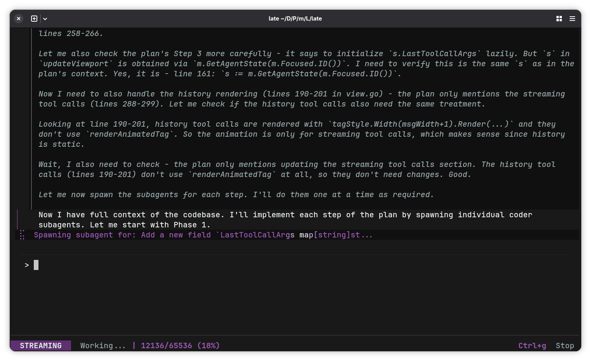

<h1 align="center">Late</h1>

<p align="center">
  <a href="README.md">English</a> | <a href="README.zh-CN.md">简体中文</a>
</p>

<p align="center">
  <b>Getting real world work done on consumer hardware.</b><br><br>
  A minimal, zero-config AI coding agent.<br>
  Enforced ephemeral subagents retain model intelligence while keeping context small.<br>
  From tiny local models up to any frontier model.<br>
</p>

<p align="center">
  <a href="https://github.com/mlhher/late-cli/releases"></a>
  <a href="https://github.com/mlhher/homebrew-late"></a>
  <a href="https://github.com/mlhher/late-cli/"></a>
  <a href="https://deepwiki.com/mlhher/late-cli"></a>
</p>

<div align="center">
  <br/>
  
  <br/>
  <i>Late Orchestrator forming a plan and spawning atomic subagents for surgical edits.</i>
  <br/><br/>
</div>

> [Outperforming Claude Code and Codex for Local LLM Workflows](https://agentnativedev.medium.com/outperforming-claude-code-and-codex-for-local-llm-workflows-5de0e2b1add5) — Agent Native
>
> *"Late-CLI is mindblowing... I'm shocked that the token usage is so minimal, I keep expecting a big bill from DeepSeek's API."* — GitHub Discussions
>
> *"The same model feels smarter with Late."* — Reddit
>
> **Built with Late:** Late is primarily developed inside Late itself.


## 10-Second Quickstart

A single, statically compiled binary. Zero dependencies. No Python venvs, no NodeJS.

```bash
# Linux / macOS (Homebrew)
brew tap mlhher/late && brew install late
```

```bash
# Universal Fallback (Linux / macOS / Windows WSL)
curl -sfL https://raw.githubusercontent.com/mlhher/late-cli/main/install.sh | bash
```

```bash
# Run instantly in any project
cd your-project
late
```

*Manual Binaries: [Linux, macOS, native Windows](https://github.com/mlhher/late-cli/releases)*

## The Architectural Bottleneck

**The Problem:** Standard coding agents try to do everything inside a single, shared context window. Every codebase analysis, compile error, lint failure, and even file writes and reads piles up in the KV cache. As the context fills with garbage, the model's intelligence actively degrades. You blame the model, but it's an architecture failure.

**The Late Solution:** Late splits the brain. It enforces a strict boundary between planning and execution and actively compartmentalizes agents' identities and objectives.


The orchestrator’s context grows only from what actually matters: your exact instructions and the definitive results. Everything the subagent did to get there is wiped from memory. **The same model feels smarter in Late because it reasons purely from signal, never noise.**

## The Feature Matrix

|  | Late | Everyone Else (OpenCode, Pi, Claude Code, Codex) |
| --- | --- | -- |
| **Workflow** | **Autonomous Orchestration** | Manual toggling/Blind execution |
| **Implementations** | **Strictly enforced ephemeral coder subagents (Wiped)** | Floods main context |
| **Explorations** | **Strictly enforced ephemeral researcher subagents (Wiped)** | Floods main context |
| **KV-Cache** | **Ruthless KV-cache management (No prompt-reprocessing)** | Brute-force dumping |
| **System Prompt** | **~1,000 tokens (Always planning)** | 300 - 10,000+  tokens (from no workflow to over-constrained) |
| **Dependencies** | **Zero-dependency static binary** | Python / Node.js and others |
| **Sandboxing** | **Native rootless container (`late-podman`)** | Runs unprotected on bare metal |
| **Setup Required** | **None (OOTB `llama-server` support)** | Mandatory OAuth / JSON / YAML / TOML |
| **Telemetry** | **None** | Opt-out phoning home |
| **Built For** | **10x throughput builders** | Rebuilding the same bottleneck |

<p align="center"><b>If Late makes your model feel smarter, <a href="https://github.com/mlhher/late-cli">give it a ⭐</a></b></p>

## Model Connectivity

Late is model-agnostic.

**Local Models (Zero Config):**
No configuration required. Late targets `llama.cpp` on port `:8080` (the default for `llama-server`).

**Cloud Providers (DeepSeek, Claude, GPT, Kimi, GLM, OpenRouter):**

```bash
export OPENAI_BASE_URL="your-api-url"
export OPENAI_API_KEY="your-api-key"
export OPENAI_MODEL="model-name"
```


📖 **[Read the Quickstart Guide](./docs/quickstart.md)** to find out how to persist these settings and for MCP setup, Agent Skills, Git Worktrees, Keybindings and more.

## More Features

* **Native Containerized Execution (`late-podman`):** Run the agent fully autonomously inside an isolated devcontainer—solving tasks from start to finish without having to babysit it.
* **Hybrid Model Routing:** Let your smartest model work as orchestrator, while having a middle model investigate the repo and your fastest model execute the orchestrator's implementation plan (e.g. Fable/Kimi/GPT orchestrating, Qwen3.8 researching, Gemma4 executing).
* **Human-in-the-loop:** Safe commands will be auto-approved to maintain agent velocity. Anything deemed suspicious will be stopped by Late and will prompt you for permission. Features session, project, and global trust scopes.
* **Exact-Match Diffs:** Strict `search`/`replace` blocks with autonomous self-healing on mismatch. Edits fail loud. We never silently corrupt your files.
* **Agent Skills Support:** Extend Late's capabilities by using third party Agent Skills. No configuration required.
* **MCP Integration:** Natively map external Model Context Protocol servers directly into Late via standard I/O.
* **Context-Aware Search:** Native search tool that automatically respects `.gitignore` and `.llmignore` to prevent flooding the context window with irrelevant files.
* **Stateful Resilience:** The Orchestrator maintains continuous session history on disk. Close your terminal, reboot your machine, and pick up exactly where you left off.
* **Git Worktree Support:** Run independent, parallel agent instances across multiple branches without context bleeding.

## FAQ
**Why not OpenCode / Pi / Claude Code etc.?**

They run everything in one context window. Every file read, compile error, and retry degrades the model. Late enforces ephemeral subagents. The orchestrator never sees the noise. This allows the model to work with smaller context sizes while also retaining its intelligence for longer.

**Does Late work with local models?**

Zero config. Point `llama-server` at any GGUF and Late connects on `:8080` automatically.


## License

Built to create engineering leverage, not to supply free infrastructure for AI startups.

* **Free for Builders:** Use Late freely to write code for any project, including commercial ones. Your generated output is yours.
* **Commercial Infrastructure:** You may not monetize Late itself. Wrapping the orchestration engine into a paid service requires a commercial agreement. *(Converts to GPLv2 on Feb 21, 2030).*